<!-- [](https://classroom.github.com/a/cvSOEAVD) -->

# <h1 align ="center"> [bekerja](https://www.bekerja.site/) </h1>

**[bekerja](https://www.bekerja.site/)** is a creative space created for makers, nestled in a simple yet inspiring garage workshop designed with a touch of minimalistic elegance. **[bekerja](https://www.bekerja.site/)** offers a diverse array of facilities tailored to meet the needs of any aspiring craftsman or artisan.

**[link to bekerja](https://www.bekerja.site/)**

## Web Preview

<p style="font-size:20px"> Main page </p>


<br>

<p style="font-size:20px">Expanded hamburger button</p>


## Documentation

### Steps
<!-- <div style="font-size:15px"> -->

1.  Make a sketch of how the layout is going to look like.
    
    

<br>

2. Create the basic html contents.

    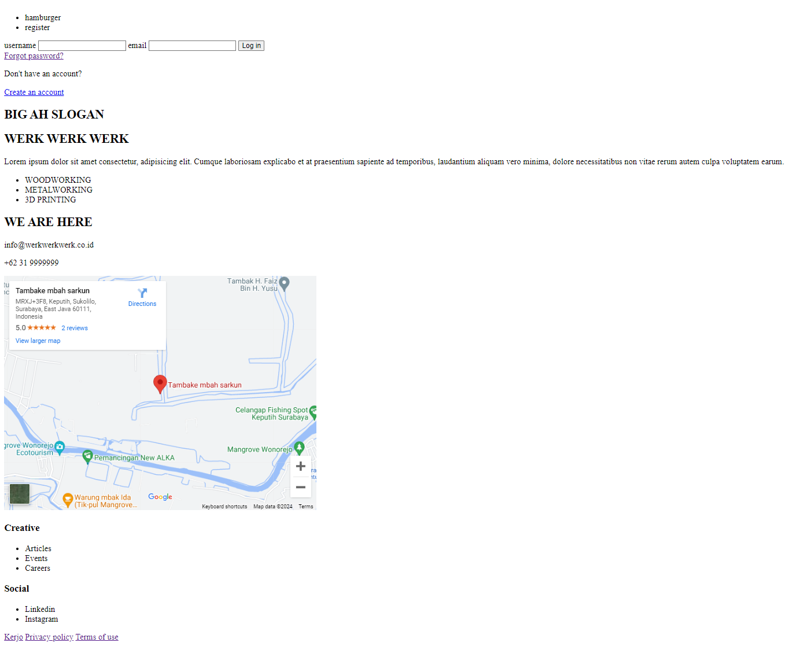

<br>

3. Set the basic layout appearances.

    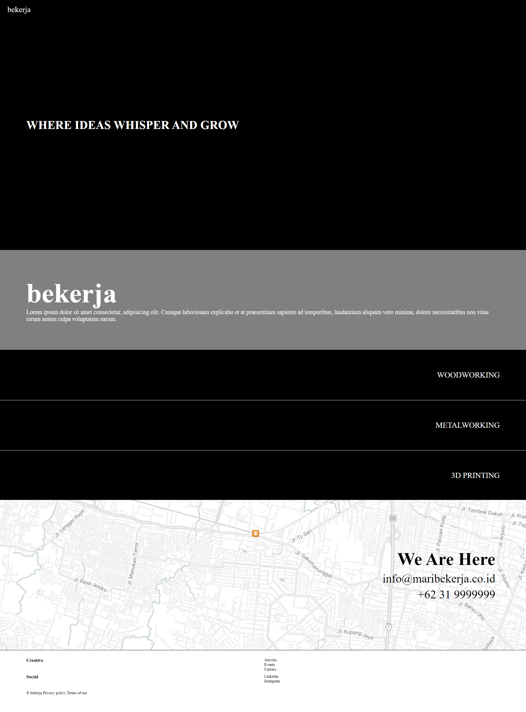

<br>

4. Add more contents and retouch the page.

    

   Embed **Playfair Display** font to add a bit of character to the text eventually also to the page itself.


   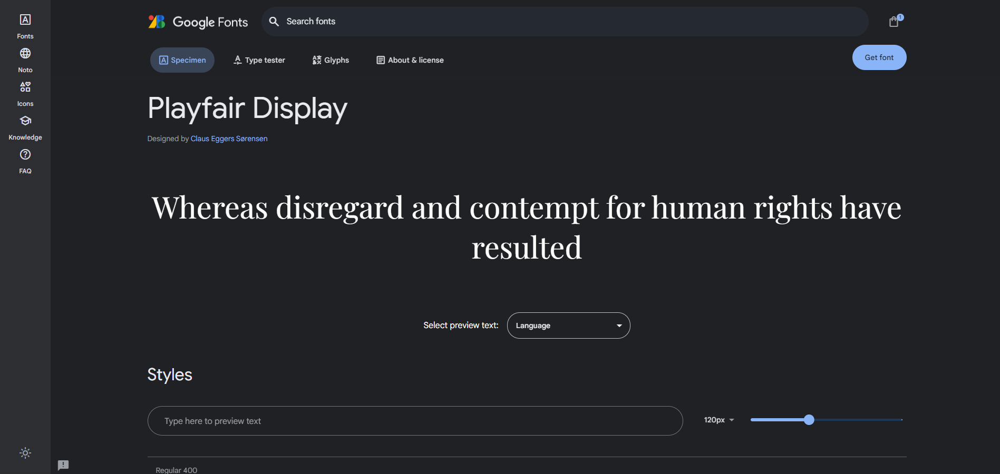

### Design Features
 
1. Algining the user form into a column direction on mobile page so the form still has a relatively the same size ratio. The purpose of this behaviour is to maintain the consistency of the overall design of the web.

    ```css
    @media(max-width:768px){
        .user-data{
        flex-direction: column;
        align-items: center;
        }
    }
    ```

   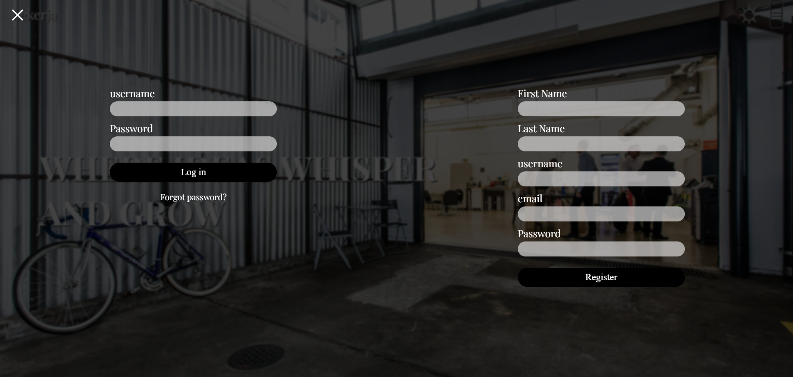

    Mobile phone display.


   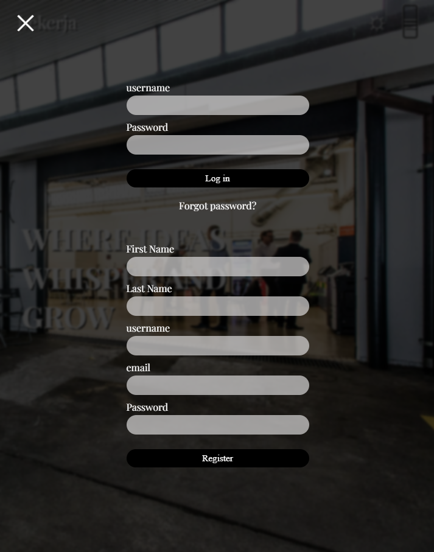

<br>

2. Create a 'highlight' to emphasize the provided facilities. This feature is activated by hovering the cursor over the list, then on the unselected items, the overall opacity will be toned down and the background images will translated off the screen.

    ```html
    <section id="sect facssect" class="sect facssect">
        <ul	class="list facs">
            <li class="facitems fac-1">WOODWORKING</li>
            <li class="facitems fac-2">METALWORKING</li>
            <li class="facitems fac-3">3D PRINTING</li>
        </ul>
    </section>
    ```


    ```css
    .facitems{
        list-style: none;
        /* height: 230px; */
        height: 33.33vh;
        display: flex;
        align-items: center;
        justify-content: end;
        font-size: 4em;
        cursor: pointer;
        padding-right: 5%;
        background-size: cover;
        background-position-y: 50%;
        transition: opacity 0.3s ease;
        background-repeat: no-repeat;
    }

    .fac-1{
        background-image: url(../src/img/compressed/joint.jpg);
    }

    .fac-2{
        background-image: url(../src/img/compressed/welding.jpg);
    }

    .fac-3{
        background-image: url(../src/img/compressed/anet-a8.jpg);
    }

    .facs:hover .facitems{
        opacity: 0.5;
        background-position-x: 2000vw;
    }

    .facs:hover .facitems:hover{
        opacity: 1;
        background-position-x: 0;
    }
    ```

   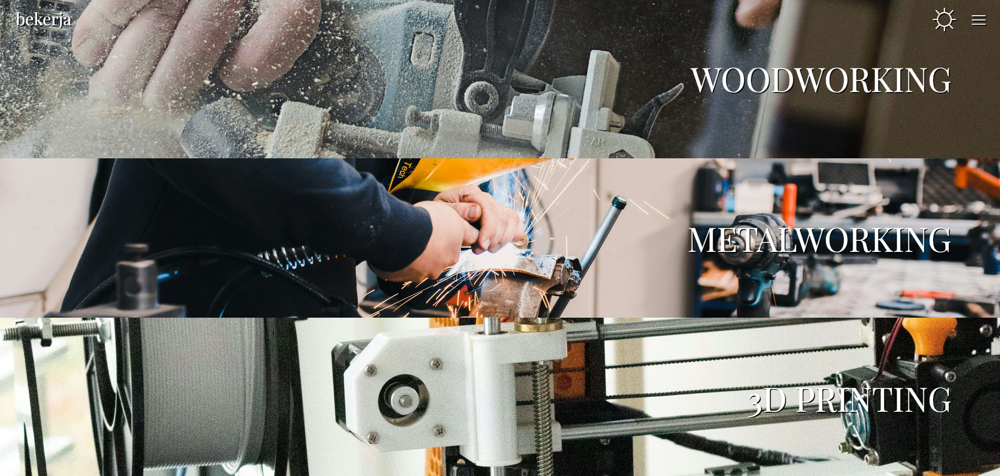

   Hovered on the METALWORKING item.

   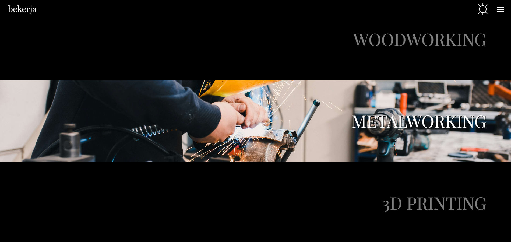

<br>

3. Showing the testimony text to add a bit more of interaction between the user and the page. Activated by trasnlating the image to the other side on the page when the cursor hovering on the testimony section.

    ```html
    <section id="sect testimonsect" class="sect testimonsect invert">
        
        <div class="container-testimon">
            <p class="testimony-about">
                What makes <span class="bekerja">bekerja</span> exceptional is its supportive community of like-minded individuals who inspire and assist each other daily. <span class="bekerja">bekerja</span> isn't just a workspace; it's a place where creativity thrives, connections deepen, and passions are reignited.</p>
            <p class="testimony-name">Bruce Wayne</p>
        </div>
    </section>
    ```


    ```css
    .testimonsect > div{
        display: flex;
        flex-direction: column;
        gap: 30px;
        font-size: 1.5rem;
        line-height: 1.75em;
        color: var(--bg-color);
        transition: color 2s ease-out;
        margin: 0 5%;
    }

    .testimony-name{
        font-size: 1.5em;
        font-weight: 500;
    }

    .testimonsect > img{
        width: 50%;
        aspect-ratio: 1/1;
        object-fit: cover;
        position: relative;
        transform: translateX(100%);
        transition: transform 2s ease;
        animation-fill-mode: forwards;
    }

    .testimonsect:hover .good-sir{
        transform: translateX(0);
    }

    .testimonsect:hover div{
        color: var(--text-color);
    }
    ```

   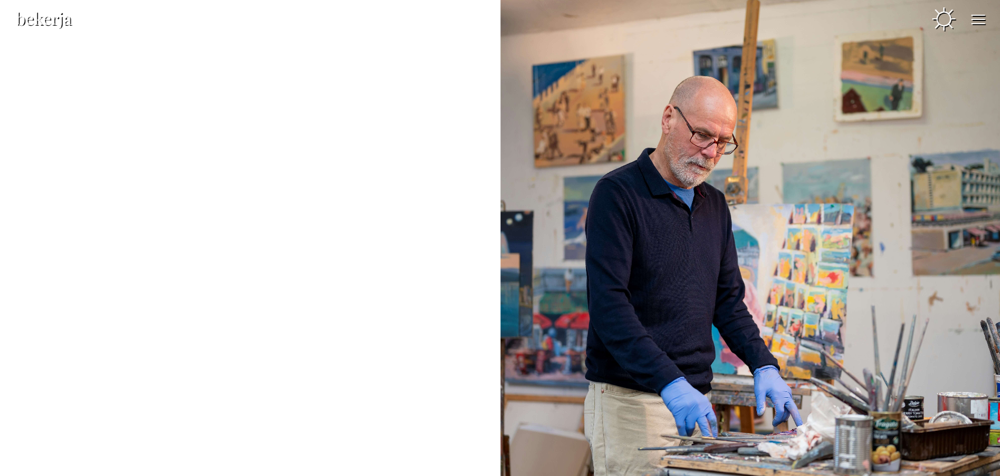
   
   The testimony being showed.

   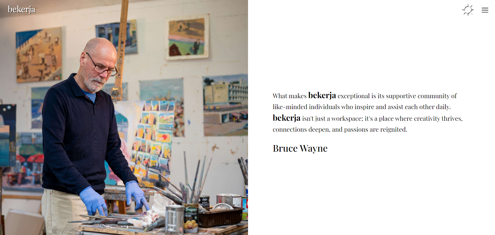

<br>

4. Changing the testimony layout on mobile display into column in order to make the text readable.


    ```css
    .testimonsect{
        flex-direction: column-reverse;
        height: 600px;
        gap: 40px;
        justify-content: space-between;
    }

    .testimonsect > img{
        width: 100%;
        height: 300px;
        object-fit: cover;
        object-position: 0px 13%;
        transform: translateY(-100%);
    }
    ```

   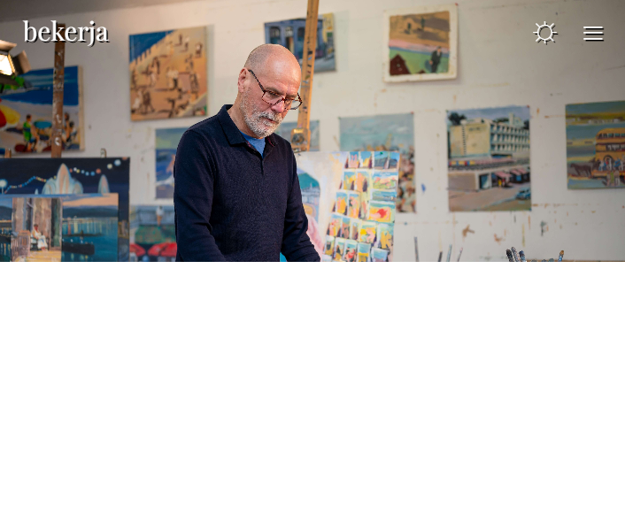
   
   The testimony being showed by trasnlating the image to the other side on the page.

   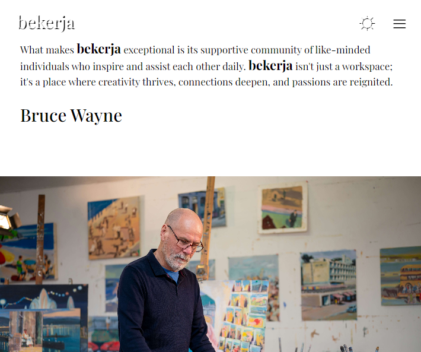

<br>

5. Show the bottom border line when the cursor hovering the item instead of underline. This makes the line's properties customizeable.

    ```css
    footer a:hover{
        border-bottom: 1px solid var(--text-color);
    }  
    ```

   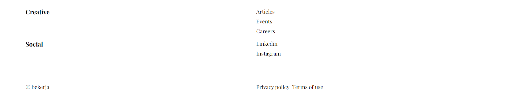
   
   Hovered on careers items

   